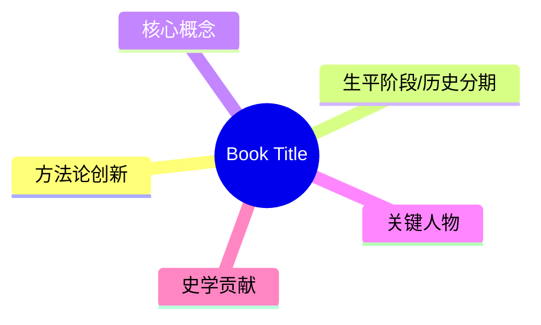
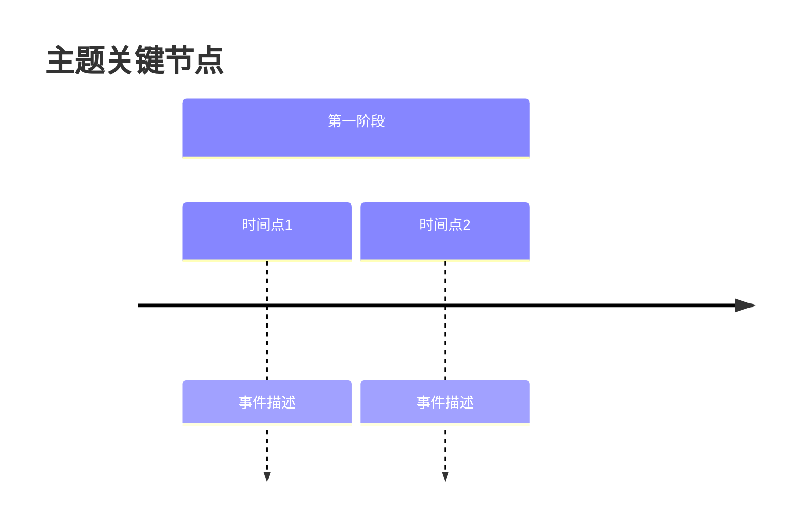

# History Note Processor

Transform Gemini chat exports and historical readings into comprehensive, academically-structured notes following established standards.

## Workflow Overview

**Input**: Gemini chat export (zip file) containing conversation about a historical work
**Output**: Structured Markdown note with YAML frontmatter, Mermaid diagrams, and Four-Step Deep Reading analysis

## Standard Operating Procedure

### Phase 1: Extract and Analyze Source

1. **Extract Gemini chat export**:
   ```bash
   unzip gemini-chat-*.zip
   cat gemini-chat-*/session.json | jq -r '.messages[] | .text' > raw_content.txt
   ```

2. **Identify core book/topic metadata**:
   - Title (Chinese + original)
   - Author
   - Publisher/year
   - Core thesis
   - Key concepts

### Phase 2: Structure with YAML Frontmatter

**Required frontmatter fields**:
```yaml
---
title: "中文书名"
original_title: "Original Title"
author: "Author Name"
translator: "译者姓名（如适用）"
publisher: "Publisher Name"
year: YYYY
series: "丛书系列（如适用）"
category:
  - 主分类
  - 次分类
tags:
  - 关键概念1
  - 关键概念2
core_thesis: "核心论点的一句话总结"
key_concepts:
  - 关键概念1详细名称
  - 关键概念2详细名称
methodology:
  - 方法论1
  - 方法论2
related_works:
  - "《相关著作1》- 作者"
  - "《相关著作2》- 作者"
reading_date: YYYY
status: completed
---
```

### Phase 3: Four-Step Deep Reading Structure

Organize content into four mandatory sections:

**🟢 Stage 1: Foundation (文本细读与脉络梳理)**
- Chapter-by-chapter logical breakdown
- Core concepts extraction
- Primary source analysis
- Historical timeline (Mermaid timeline)

**🔵 Stage 2: Critique (学术定位与文献综述)**
- Historiographical positioning
- Scholarly debates (intentionalist vs structuralist, etc.)
- Methodological analysis
- Critical assessment

**🟣 Stage 3: Context (背景扩展与知识考古)**
- Institutional/technical archaeology
- Key figures deep dives
- Cross-cultural background
- Hidden historical details

**🔴 Stage 4: Synthesis (终极综合与理论升华)**
- Logical closure
- Theoretical elevation
- Critical evaluation
- Contemporary relevance

### Phase 4: Visualization Requirements

**Include these Mermaid diagrams**:

1. **Opening mindmap** (核心思维导图):


2. **Timeline** (关键时间轴):


3. **Flowcharts/graphs** as needed for:
   - Causal chains
   - Power structures
   - Conceptual relationships
   - Historical processes

### Phase 5: Search and Expansion Strategy

**For each major topic/concept**:

1. **Verify with web search**:
   - Historical events: dates, participants, outcomes
   - Key figures: biographical details, roles, fates
   - Technical terms: precise definitions, scholarly usage
   - Scholarly debates: major positions, representatives

2. **Cross-reference framework**:
   - Check claims against established historiography
   - Verify statistical data
   - Confirm quotations and attributions
   - Identify missing context

3. **Add "Sources 来源汇总" section**:
   - Academic sources
   - Wikipedia/encyclopedias
   - Specialized databases
   - All web search results used

### Phase 6: Quality Checklist

Before finalizing, verify:

- [ ] YAML frontmatter complete and properly formatted
- [ ] All four stages (🟢🔵🟣🔴) present with substantial content
- [ ] Minimum 3 Mermaid diagrams (mindmap, timeline, + others)
- [ ] Tables used for structured comparisons
- [ ] Web search conducted for major claims (minimum 10 searches)
- [ ] Sources section with all URLs
- [ ] Related works section populated
- [ ] File name format: `《书名》-最终.md`

## Output Formatting Standards

**Section markers**:
- Use `##` for main sections (四个阶段)
- Use `###` for subsections
- Use `####` for detailed breakdowns

**Visual emphasis**:
- Use `***` for horizontal rules between major sections
- Use `> **Blockquotes**` for key quotations or important findings
- Use tables for structured comparisons
- Use code blocks for specific examples

**Chinese academic style**:
- Maintain formal academic tone
- Use traditional scholarly markers (如、即、然、则、等)
- Balance accessibility with rigor

## File Organization

**Save location**: `/Users/leo/Desktop/新笔记/历史学/《书名》-最终.md`

**Naming convention**: Chinese title in full-width guillemets 《》, followed by `-最终`

## Reference Format

See `references/template-example.md` for a complete example following all standards.

## Common Pitfalls to Avoid

1. **Incomplete YAML**: Don't skip methodology or key_concepts fields
2. **Missing visualizations**: Each stage should have at least one diagram
3. **Unsourced claims**: Always verify dates, statistics, and major historical claims with web search
4. **Flat structure**: Use subsections generously to create hierarchical organization
5. **No critical analysis**: Stage 2 (🔵 Critique) must engage with scholarly debates, not just summarize
