# 《墨索里尼与法西斯意大利》深度研读笔记

## 核心思维导图

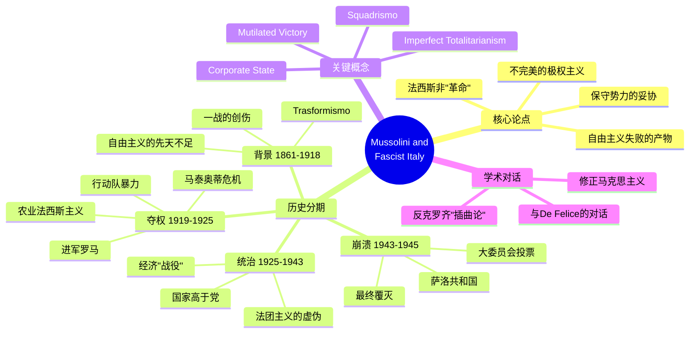

---

## 全书结构概览

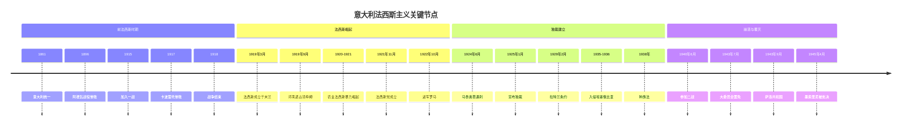

---

### 🟢 第一阶段：文本细读与脉络梳理 (The Foundation)

马丁·布林克霍恩（Martin Blinkhorn）的这本书并非简单的传记，而是一部**政治社会史**。全书的核心论点可以归纳为：**意大利法西斯主义并非一场彻底的"革命"，而是自由主义国家的失败与保守势力为了维持现状而进行的"妥协"的产物。**

#### 1. 章节逻辑与深度拆解

```mermaid
flowchart TB
    subgraph Part1["第一部分：背景与温床"]
        A1[自由主义的先天不足] --> A2[Trasformismo变通主义]
        A2 --> A3[南北社会经济断裂]
        A3 --> A4[一战的创伤与"残缺的胜利"]
    end

    subgraph Part2["第二部分：权力的攫取"]
        B1[早期法西斯的城市失败] --> B2[农业法西斯主义崛起]
        B2 --> B3[精英的共谋]
        B3 --> B4[进军罗马]
        B4 --> B5[马泰奥蒂危机与独裁确立]
    end

    subgraph Part3["第三部分：独裁统治"]
        C1[国家高于党] --> C2[法团主义的虚伪]
        C2 --> C3[经济政策与政治威望]
        C3 --> C4[寻求共识]
    end

    subgraph Part4["第四部分：外交与崩溃"]
        D1[修正主义外交] --> D2[埃塞俄比亚战争]
        D2 --> D3[与纳粹结盟]
        D3 --> D4[二战与萨洛共和国]
    end

    Part1 --> Part2 --> Part3 --> Part4
```

**第一部分：背景与温床（自由主义意大利的失败）**

- **自由主义的先天不足（1861-1915）：** 意大利统一（Risorgimento）留下了复杂的遗产。新国家缺乏群众基础，"制造意大利人"的过程举步维艰。政治上实行**"变通主义"（Trasformismo）**，即通过利益交换而非明确的政党纲领来维持议会多数，导致政治腐败和代表性缺失。

| 自由主义国家的结构性缺陷 | 具体表现 |
|:------------------------:|:---------|
| 政治代表性缺失 | 选民仅占人口2%，精英封闭统治 |
| Trasformismo | 无原则的利益交换，缺乏真正的政党竞争 |
| 南北断裂 | 北方工业化vs南方封建农业 |
| 国家-社会疏离 | "合法的意大利"与"真实的意大利"分离 |

- **社会经济的断裂：** 南北差距巨大。北方工业化催生了强大的资产阶级和无产阶级，而南方依然处于落后的农业封建状态。

- **战争的催化剂：** 第一次世界大战是转折点。它暴露了意大利作为"大国中最弱小者"的虚弱，同时也制造了数百万心怀不满的退伍军人。

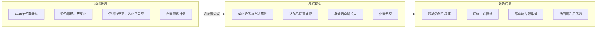

**第二部分：权力的攫取（1919-1925）**

- **从城市到农村的转向：** 早期的法西斯主义（1919年）带有左翼、共和主义色彩，但在城市选举中惨败。其真正的崛起在于**"农业法西斯主义"（Agrarian Fascism）**的兴起——即波河平原的地主利用法西斯**"行动队"（Squadrismo）**暴力镇压社会主义农民联盟。

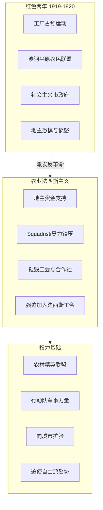

- **精英的共谋：** 作者明确反对"法西斯革命夺权"的神话。实际上，是自由派政治家（如焦利蒂）、工业家、地主、军队和国王通过**"进军罗马"（March on Rome）**这一政治虚张声势，将墨索里尼扶上了马，试图利用他来驯服左翼，然后再将其"正常化"吸纳进体制内。

| 进军罗马的真相 | 传统神话 | 历史真相 |
|:-------------:|:---------|:---------|
| 性质 | 革命夺权 | 政治虚张声势 |
| 参与人数 | 数十万黑衫军 | 不足30,000人 |
| 墨索里尼角色 | 亲率进军 | 在米兰等待，乘火车抵达 |
| 关键因素 | 军事胜利 | 国王拒绝宣布戒严 |
| 伤亡 | 法西斯宣称3,000人 | 实际约12人 |

- **独裁的确立：** 马泰奥蒂危机（Matteotti crisis）是分水岭。墨索里尼在保守派的默许下，利用危机铲除反对派，建立了独裁统治。

**第三部分：独裁统治的运作（党与国家）**

- **国家高于党（State over Party）：** 与纳粹德国不同，墨索里尼更依赖传统的国家机器（省长、警察）而非党务系统来治理国家。法西斯党（PNF）逐渐官僚化，变成了寻求职位者的工具，而非革命的引擎。

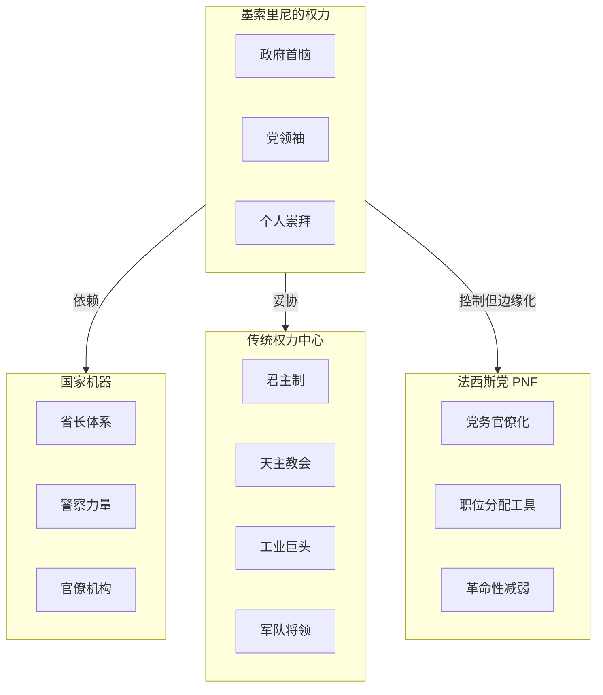

- **法团主义（Corporate State）的虚伪：** 作者剖析了被吹捧为法西斯原创的"法团主义"。理论上它是资本与劳工的合作，实际上它剥夺了工人的组织权，成为了 disciplining labour（规训劳工）以服务于雇主利益的工具。

| 法团主义 | 理论宣称 | 实际运作 |
|:--------:|:---------|:---------|
| 本质 | "第三条道路" | 偏向资本的控制手段 |
| 工人权利 | 资本劳工合作 | 独立工会被取缔、罢工非法 |
| 工资 | 公平协商 | 1928-1932下降近50% |
| 受益者 | 全体国民 | 大企业和大地主 |

- **经济政策：** 从早期的自由放任转向保护主义。**"粮食之战"（Battle for Grain）**和**"里拉定值90"（Quota 90）**是出于政治威望而非经济理性的决策。

**第四部分：外交、帝国与崩溃（1922-1945）**

- **修正主义外交：** 墨索里尼的外交政策始终由"修正一战和约"的欲望驱动。从早期的谨慎到后来的侵略（埃塞俄比亚、西班牙内战），反映了他对"强权"的痴迷。

- **"钢索"上的舞蹈：** 与希特勒结盟使意大利沦为从属地位。埃塞俄比亚战争是法西斯政权的顶峰，此后便是不可逆转的衰落。

- **萨洛共和国（Salò Republic）：** 充满讽刺的历史注脚。在纳粹保护下建立的傀儡政权试图回归早期法西斯的"激进社会纲领"，但在德国的占领下显得空洞且残暴。

#### 2. 核心概念提取 (Key Concepts)

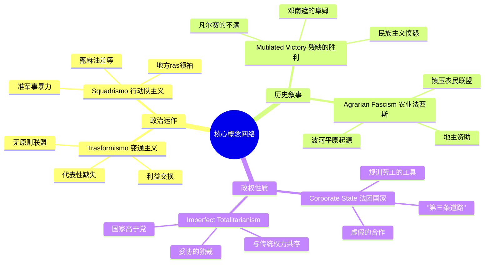

- **Trasformismo（变通主义）：** 自由主义时期意大利政治的腐败特征，缺乏原则的联盟。

- **Squadrismo（行动队主义）：** 法西斯主义特有的准军事暴力形式，通过殴打、灌蓖麻油等方式羞辱对手。

- **Mutilated Victory（残缺的胜利）：** 意大利民族主义者对一战战后安排的怨恨叙事。

- **Corporate State（法团国家）：** 法西斯试图超越资本主义和社会主义的"第三条道路"，但在实践中沦为偏向资本的控制手段。

- **Imperfect Totalitarianism（不完美的极权主义）：** 布林克霍恩对墨索里尼政权的定性——因为它无法彻底征服教会、皇室和军队。

#### 3. 史料与视角关注

| 史料类型 | 来源 | 特点 |
|:--------:|:-----|:-----|
| 二手综述 | 大量引用学术研究 | 与De Felice频繁对话 |
| 自上而下 | 高层政治操作 | 墨索里尼与精英博弈 |
| 自下而上 | 波河平原阶级斗争 | 农业法西斯的社会根源 |

- **史料来源：** 作为综述类书籍，作者大量引用了二手研究。特别值得注意的是，他频繁与**伦佐·德·费利切（Renzo De Felice）**的观点进行对话。

- **视角：** 作者采取了**"自上而下"与"自下而上"结合**的视角，既关注墨索里尼的高层政治操作，也分析了"农业法西斯主义"的社会根源。

#### 4. 第一阶段总结性点评

这本书虽然篇幅不长，但其学术密度很高。它非常清晰地解构了法西斯神话，让我们看到其背后的机会主义和妥协本质。布林克霍恩强调，法西斯政权在其统治期间始终未能实现真正的"极权主义"，而是不得不与君主、教会、工业巨头等传统权力中心共享权力。

---

### 🔵 第二阶段：学术定位与文献综述 (The Critique)

在这一阶段，我们将这本书置于法西斯研究的学术版图中，分析它如何挑战或修正既有的历史解释。

#### 1. 史学对话：修正与平衡

```mermaid
graph TB
    subgraph 克罗齐学派["克罗齐"道德疾病论""]
        C1[法西斯是"插曲"]
        C2[自由主义的短暂病毒]
        C3[与历史进程无关]
    end

    subgraph 马克思主义["马克思主义"资本傀儡论""]
        M1[法西斯是金融资本的打手]
        M2[经济决定论]
        M3[阶级分析]
    end

    subgraph DeFelice["De Felice修正主义"]
        D1["共识"理论]
        D2[中产阶级革命]
        D3[运动vs政权区分]
    end

    subgraph Blinkhorn["Blinkhorn后修正主义"]
        B1[法西斯是自由主义失败的产物]
        B2[承认共识但强调其消极性]
        B3[强调妥协而非极权]
        B4[墨索里尼的"相对独立性"]
    end

    克罗齐学派 -.反驳.-> Blinkhorn
    马克思主义 -.修正.-> Blinkhorn
    DeFelice -.对话.-> Blinkhorn
```

马丁·布林克霍恩的这部作品占据了**"后修正主义"（Post-revisionist）**位置：

**挑战"道德疾病论"（Anti-Croce）：**

| 克罗齐观点 | 布林克霍恩反驳 |
|:----------|:---------------|
| 法西斯是"插曲" | 法西斯深植于自由主义的结构性失败 |
| 偶然的"病毒入侵" | 历史的必然产物 |
| 与之前制度无关 | 与Trasformismo存在连续性 |

**修正"资本主义傀儡论"（Nuanced Marxism）：**

虽然承认工业家和地主是法西斯上台的关键推手，但通过分析法西斯外交政策指出，墨索里尼拥有相当大的**"相对独立性"（Relative Autonomy）**。当政治野心与经济理性冲突时，墨索里尼往往选择前者。

**与德·费利切（De Felice）的复杂对话：**

| De Felice观点 | Blinkhorn回应 |
|:-------------|:--------------|
| 1929-1936年获得广泛"共识" | 承认共识存在 |
| 代表新兴中产阶级的革命 | 解构为"消极的默许" |
| 法西斯运动的革命性 | 强调其妥协性质 |

布林克霍恩将"共识"解构为源于**恐惧、缺乏替代选项以及物质小恩小惠**（如Dopolavoro休闲组织），而非真正的意识形态认同。

#### 2. 方法论分析

```mermaid
flowchart TB
    subgraph 方法论["布林克霍恩的方法论"]
        M1[去神话化 Demystification]
        M2[结构主义+意图主义结合]
        M3[英国经验主义史学]
    end

    subgraph 去神话化["去神话化分析"]
        D1[法西斯自称"极权主义"]
        D2[实际是"多头政治"]
        D3[墨索里尼是"掮客"而非全能独裁者]
    end

    subgraph 社会史["社会史视角"]
        S1[不仅关注罗马高层]
        S2[深入波河平原农村]
        S3[分析农业法西斯的阶级基础]
    end

    方法论 --> 去神话化
    方法论 --> 社会史
```

- **去神话化（Demystification）：** 系统性地剥离了法西斯政权的自我宣传，揭示了墨索里尼并非全能的独裁者，而是必须在国王、教皇、军队和工业家之间不断进行权力博弈的"掮客"（Broker）。

- **社会史视角的引入：** 深入到了波河平原的农村，揭示了法西斯运动的阶级基础——面临社会主义威胁的地主、中农和失落的中产阶级的反动联盟。

#### 3. 论题深化

**议题一："不完美的极权主义"（Imperfect Totalitarianism）**

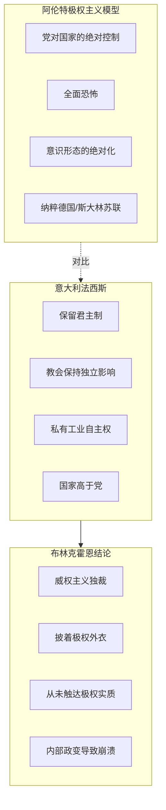

传统的极权主义理论以纳粹德国或斯大林苏联为模板。布林克霍恩指出，意大利法西斯是一个**"妥协的政权"**：
- 保留了君主制（这最终导致了他的倒台）
- 通过《拉特兰条约》与教会和解
- 保留了私有工业的自主权

**议题二：外交政策的连续性 vs. 断裂性**

布林克霍恩倾向于认为存在**底层的连续性**——从自由主义时期的殖民野心，到法西斯的帝国梦，意大利始终追求"大国地位"。但法西斯主义注入了独特的**"社会达尔文主义"和"尚武精神"**。

#### 4. 学术综述结语

| 评价维度 | 内容 |
|:--------:|:-----|
| **贡献** | 打破"法西斯铁板一块"的刻板印象，展示政权内部的裂痕和妥协 |
| **框架** | 提供理解法西斯的绝佳框架：软弱的自由主义国家被结构松散的独裁取代 |
| **局限** | 对文化史（法西斯美学、现代主义艺术）的探讨相对较少 |
| **定位** | 清醒的修正主义（Sober Revisionism） |

---

### 🟣 第三阶段：背景扩展与知识考古 (The Context)

这一阶段通过"知识考古"将书中的静态叙事激活，补充关键的历史拼图。

#### 1. 技术/制度考古

**A. "法西斯美学"的真正发明者：加布里埃尔·邓南遮 (Gabriele D'Annunzio)**

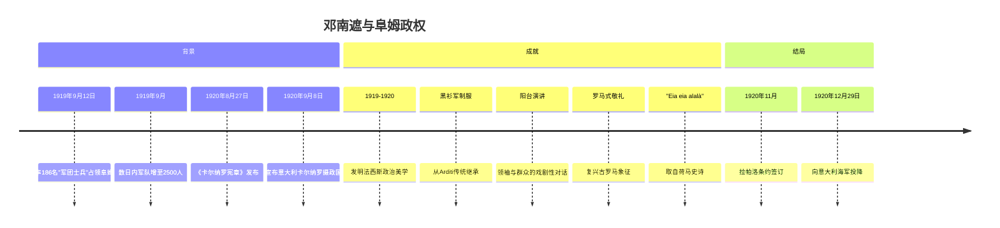

- **书中线索：** 书中提到他在阜姆的"摄政"是法西斯的预演
- **考古补充：** 邓南遮被称为**"意大利法西斯的施洗约翰"**。法西斯后来标志性的**阳台演讲、罗马式敬礼、黑衫军制服、以及口号"Eia, eia, alalà!"**，全部由邓南遮在阜姆发明。墨索里尼实际上是一个模仿者。

**《卡尔纳罗宪章》的独特性：**
| 特点 | 内容 |
|:----:|:-----|
| 法团主义雏形 | 9个职业法团代表经济各部门 |
| 第十法团 | 邓南遮发明，代表"超人"——英雄、诗人、先知 |
| 音乐为国家基石 | 宪章明确规定音乐是国家的根本原则 |
| 普选权 | 引入全民普选 |

**B. 马泰奥蒂遇刺案 (The Matteotti Affair) 的血腥细节**

```mermaid
flowchart TB
    subgraph 背景["事件背景"]
        B1[1924年5月30日 马泰奥蒂国会演讲]
        B2[揭露法西斯选举舞弊]
        B3[要求废除选举结果]
    end

    subgraph 遇刺["遇刺经过"]
        K1[1924年6月10日 被绑架]
        K2[法西斯秘密警察Ceka执行]
        K3[两个月后尸体被发现]
    end

    subgraph 危机["马泰奥蒂危机"]
        C1[公众震惊与愤怒]
        C2[反对派"阿文丁分裂"]
        C3[墨索里尼政权动摇]
    end

    subgraph 结果["意外后果"]
        R1[反对派退出议会]
        R2[墨索里尼失去制衡]
        R3[1925年1月3日宣布独裁]
    end

    背景 --> 遇刺 --> 危机 --> 结果
```

- **"石油踪迹"：** 审判文件揭示，谋杀与美国辛克莱石油公司向法西斯领导人行贿以换取意大利石油开采垄断权有关
- **政治悖论：** "阿文丁分裂"反而帮助了墨索里尼，反对派的主动退出使议会失去制衡力量

**C. "行动队主义"（Squadrismo）的暴力机制**

| 维度 | 内容 |
|:----:|:-----|
| 起源 | 1919年3月在米兰成立首批行动队 |
| 规模 | 1922年进军罗马时约20万人 |
| 组成 | 退伍军人、小地主、失落的中产阶级 |
| 资金 | 农业资本家和工业家赞助 |
| 暴力形式 | 殴打、灌蓖麻油、纵火、强迫流亡 |
| 1921-1922伤亡 | 207人政治谋杀，受害者多为社会主义者 |


#### 2. 人物考古

**罗伯托·法里纳奇 (Roberto Farinacci)：极端派代表**

| 维度 | 内容 |
|:----:|:-----|
| 背景 | 出身贫困，克雷莫纳铁路工人 |
| 地位 | 克雷莫纳的"ras"（地方领袖） |
| 特点 | "顽固派"法西斯主义者 |
| 党内地位 | 1925-1926年党书记 |
| 意识形态 | 反教权、排外、反犹 |
| 主张 | 回归行动队主义的"革命"根源 |
| 最终命运 | 1945年4月28日被游击队枪决 |

法里纳奇代表了法西斯党内的"顽固派"，主张激进路线，与墨索里尼的实用主义形成张力。

**加莱阿佐·齐亚诺 (Galeazzo Ciano)：墨索里尼的女婿**

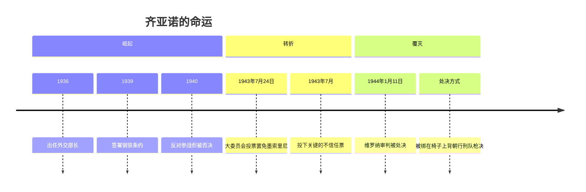

**法西斯大委员会1943年7月25日投票：**
- 投票结果：19票赞成不信任、8票反对、1票弃权
- 关键叛变者：齐亚诺、德·博诺元帅
- 后果：墨索里尼被国王解职逮捕
- 报复：维罗纳审判处决投票者

#### 3. 跨文化背景与细节

**"粮食之战"的隐性代价**

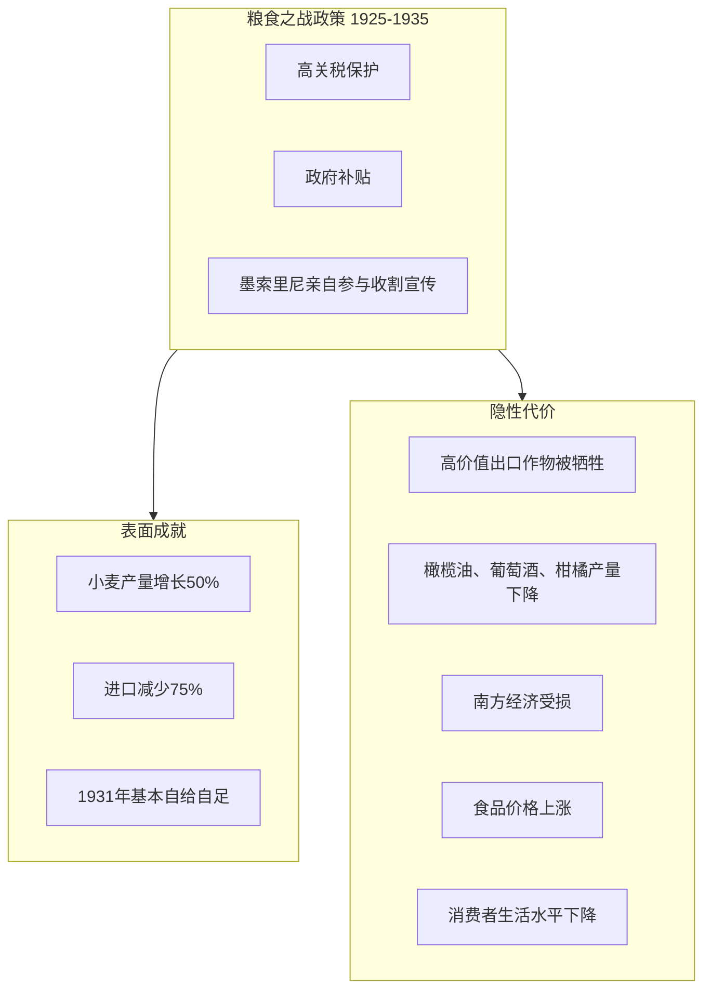

- **受益者：** 大地主和重工业
- **受害者：** 南方农业和普通消费者
- **本质：** "北方工业/谷物利益集团"对"南方农业/消费者"的隐性剥削

**"里拉定值90"（Quota 90）的政治经济学**

| 维度 | 内容 |
|:----:|:-----|
| 宣布时间 | 1926年8月18日佩萨罗演讲 |
| 目标汇率 | 90里拉兑1英镑 |
| 当时汇率 | 148里拉兑1英镑 |
| 动机 | 政治威望而非经济理性 |
| 受益者 | 依赖进口的重工业、钢铁、化工 |
| 受害者 | 出口行业、消费者、农业南方 |
| 后果 | 实际工资下降、失业上升、1928-1929企业合并潮 |

**法西斯青年组织：Balilla与意识形态灌输**


**埃塞俄比亚战争：法西斯的顶峰与转折**

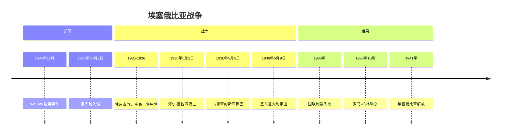

| 战争数据 | 内容 |
|:--------:|:-----|
| 意军兵力 | 20万人 |
| 武器优势 | 800辆坦克、595架飞机 vs 埃塞4辆坦克、13架飞机 |
| 使用手段 | 毒气、空袭、火焰喷射器、集中营 |
| 国际反应 | 国联制裁但未实施石油禁运 |
| 秘密协议 | 霍尔-拉瓦尔协定（泄露后引发丑闻） |

**1938年种族法：迟来的反犹主义**

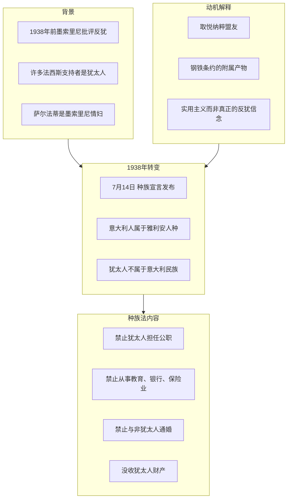

- **意大利犹太人命运：** 约80%在大屠杀中幸存
- **党内反对：** 巴尔博等法西斯领导人反对种族法

#### 4. 关键史料/视角补充

**萨洛共和国（1943-1945）：法西斯的最后挣扎**

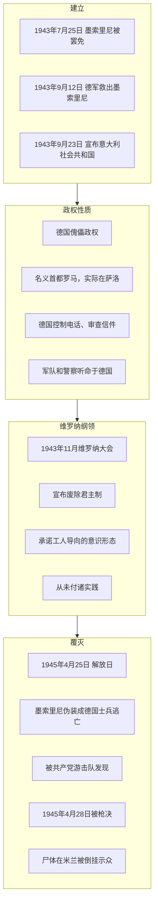

---

### 🔴 第四阶段：终极综合与理论升华 (The Synthesis)

#### 1. 逻辑闭环：历史叙事的重构

```mermaid
flowchart TB
    subgraph 起源["起源的平庸"]
        O1[自由主义的政治无能]
        O2[精英无法整合大众]
        O3[与"次要威胁"结盟镇压"主要威胁"]
    end

    subgraph 掌权["掌权的本质"]
        P1["进军罗马"是政治虚张声势]
        P2[旧体制的"自我保全赌博"]
        P3[利用法西斯后再"正常化"]
    end

    subgraph 统治["统治的悖论"]
        R1["经纪人独裁"]
        R2[在党、国、教会、工业间周旋]
        R3[内政空心化]
        R4[消极共识而非真正支持]
    end

    subgraph 崩溃["崩溃的必然"]
        C1[内政无法提供持久合法性]
        C2[依赖外交冒险维持神话]
        C3[战争暴露政权虚弱]
        C4[内部政变而非外部征服]
    end

    起源 --> 掌权 --> 统治 --> 崩溃
```

基于布林克霍恩的文本及补充的语境，我们可以构建出一条关于意大利法西斯主义的**终极叙事链条**：

- **起源的平庸：** 法西斯主义并非横空出世的恶魔，而是自由主义意大利长期**政治无能（Political Incompetence）**的私生子。

- **掌权的本质：** 所谓的"进军罗马"是一场巨大的**政治虚张声势（Bluff）**。墨索里尼的上台不是革命的胜利，而是旧体制**"自我保全的赌博"**。

- **统治的悖论：** 墨索里尼建立了一个**"经纪人独裁"（Brokerage Dictatorship）**。他不是全能的主宰，而是在党、国家、教会和工业资本之间进行利益交换的中间人。

- **崩溃的必然：** 由于内政无法提供持久的合法性，墨索里尼必须依赖**外交冒险**来制造神话。这种将"战争作为内政延伸"的逻辑，最终暴露了其政权的虚弱本质。

#### 2. 核心结论：法西斯主义的三重面相

```mermaid
mindmap
  root((法西斯主义的<br/>三重面相))
    反现代的现代化者
      现代动员手段
        广播
        群众集会
        休闲组织
      反现代目标
        维护乡村等级
        恢复古罗马荣耀
        形式现代内核反动
    武装的变通主义
      缺乏原则
      利益输送维持统治
      手段从议会私下交易
      变成街头棍棒蓖麻油
    权力的美学化
      实质性政策失败
      转向纯粹表演
      仪式制服口号本身成为政治内容
      用审美狂欢掩盖政治空虚
```

**作为"反现代的现代化者" (The Anti-modern Modernizer)：**

这是全书最深刻的悖论。法西斯利用现代的动员手段（广播、群众集会、休闲组织）来追求反现代的目标（维护传统的乡村等级制度、恢复古罗马的帝国荣耀）。它在形式上极其现代，在内核上却极其反动。

**作为"武装的变通主义" (Armed Trasformismo)：**

布林克霍恩暗示，法西斯主义在某种程度上是意大利传统的**"变通主义"的暴力升级版**。它依然缺乏原则，依然依靠利益输送维持统治，只是手段从议会的私下交易变成了街头的棍棒和蓖麻油。

**作为"权力的美学化" (Aestheticization of Power)：**

当实质性的政治变革（如法团主义）失败后，政权转向了纯粹的表演。仪式、制服、口号不再是表达政治内容的工具，它们**本身就成了政治内容**。

#### 3. 批判性评估

```mermaid
graph TB
    subgraph 价值["本书的终极价值"]
        V1[针对"历史浪漫化"的解毒剂]
        V2[祛魅 Disenchantment]
        V3[揭示平庸的贪婪和机会主义]
    end

    subgraph 启示["历史启示"]
        L1[独裁不是因为独裁者太强]
        L2[而是自由社会免疫系统先崩溃]
        L3[法治、制衡、公民社会的重要性]
    end

    subgraph 当代意义["当代意义"]
        M1[警惕"强人美学"的吸引力]
        M2[破除"让火车准点"的效率迷思]
        M3[理解妥协如何导致极端]
    end

    价值 --> 启示 --> 当代意义
```

如果用一句话来评价这本书的价值：**它是一剂针对"历史浪漫化"的清醒解毒剂。**

布林克霍恩用冷峻的笔触告诉我们：剥去那些黑衫、鹰徽和激昂演讲的华丽外衣，你会发现里面**既没有邪恶的天才，也没有伟大的革命**。你看到的只是**平庸的贪婪、机会主义的算计、以及一个虚弱的国家在面对现代性危机时的慌不择路**。

这就是历史学的力量——**祛魅（Disenchantment）**。它让我们明白，独裁往往不是因为独裁者太强大，而是因为自由社会的免疫系统（法治、制衡、公民社会）先自我崩溃了。

---

## 网络搜索补充内容

### 专题扩展一：Squadrismo的暴力机制与"涟漪效应"

行动队暴力的传播具有独特的"涟漪效应"（Ripple Effect）：

```mermaid
flowchart LR
    subgraph 第一阶段["选定目标"]
        A1[确定社会主义据点]
        A2[获得地主资金支持]
        A3[组织30-50人小队]
    end

    subgraph 第二阶段["暴力行动"]
        B1[袭击工会总部]
        B2[殴打、灌蓖麻油]
        B3[纵火破坏]
        B4[强迫公开羞辱]
    end

    subgraph 第三阶段["组织瓦解"]
        C1[摧毁领导层]
        C2[焚毁档案记录]
        C3[解散社会主义市政府]
    end

    subgraph 第四阶段["扩散"]
        D1[恐惧传播到邻近地区]
        D2[预防性投降]
        D3[转向下一个目标]
    end

    第一阶段 --> 第二阶段 --> 第三阶段 --> 第四阶段
    第四阶段 --> |涟漪效应| 第一阶段
```

到1921-1922年，squadristi暴力瓦解了2,100多个社会主义控制的市政府。

### 专题扩展二：伦佐·德·费利切的"共识"理论

德·费利切将法西斯区分为两个维度：

| 维度 | "作为运动的法西斯" | "作为政权的法西斯" |
|:----:|:-------------------|:-------------------|
| 性质 | 革命性的 | 保守的、妥协的 |
| 根源 | 启蒙思想 | 权力巩固需要 |
| 代表 | 新兴中产阶级 | 传统精英 |
| De Felice态度 | 试图"平反" | 批判分析 |

这种区分激怒了左翼反法西斯史学家，但也迫使学术界走出简单的道德审判。

### 专题扩展三：汉娜·阿伦特的极权主义理论与意大利的例外

阿伦特在《极权主义的起源》中明确将意大利法西斯排除在极权主义之外：

| 极权主义特征 | 纳粹德国/苏联 | 意大利法西斯 |
|:------------:|:-------------|:-------------|
| 党对国家控制 | 绝对控制 | 国家高于党 |
| 恐怖对象 | 全体人口 | 主要是政治反对派 |
| 意识形态化 | 全面渗透 | 表演性大于实质 |
| 传统权力 | 被消灭 | 与君主、教会、工业家妥协 |

阿伦特认为："意大利法西斯夺取了国家机器，却没有根本性地改变国家的权力结构。"

### 专题扩展四："生育之战"与法西斯的性别政治

```mermaid
flowchart TB
    subgraph 目标["人口目标"]
        G1[实现意大利帝国雄心]
        G2[每家至少5个孩子]
        G3[到1950年人口达到6000万]
    end

    subgraph 激励["正向激励"]
        I1[已婚贷款减免]
        I2[6个以上孩子免税]
        I3[多子母亲公开授勋]
        I4[医疗福利增加]
    end

    subgraph 惩罚["负向惩罚"]
        P1[单身税]
        P2[公务员必须已婚且有子]
        P3[1926年堕胎与避孕非法化]
        P4[限制女性就业]
    end

    subgraph 结果["实际结果"]
        R1[出生率从29.9降至19.9‰]
        R2["生育之战"完全失败]
        R3[与纳粹优生学不同]
        R4[重数量轻"质量"]
    end

    目标 --> 激励
    目标 --> 惩罚
    激励 --> 结果
    惩罚 --> 结果
```

### 专题扩展五：西班牙内战中的意大利干预

意大利对西班牙内战的干预规模远超一般认知：

| 维度 | 数据 |
|:----:|:-----|
| 总派遣人数 | 72,827人 |
| 飞机 | 763架 |
| 大炮/迫击炮 | 3,227门 |
| 轻型坦克 | 157辆 |
| 机枪 | 3,436挺 |
| 机动车 | 10,135辆 |
| 军舰/潜艇 | 91艘 |
| 伤亡 | 3,819人阵亡、10,629人受伤 |

历史学家评价："意大利人对叛军占领马拉加、贝尔梅奥、桑坦德，以及阿拉贡战线的突破和稳定起到了决定性作用。"

---

## Sources 来源汇总

### 作者与著作
- [Martin Blinkhorn - Mussolini and Fascist Italy (Routledge)](https://www.routledge.com/Mussolini-and-Fascist-Italy/Blinkhorn/p/book/9780415262071)
- [Martin Blinkhorn books (Waterstones)](https://www.waterstones.com/author/martin-blinkhorn/500151)

### 法西斯运动与暴力
- [Squadrismo - Wikipedia](https://en.wikipedia.org/wiki/Squadrismo)
- [Blackshirts - Wikipedia](https://en.wikipedia.org/wiki/Blackshirts)
- [Blackshirt - Britannica](https://www.britannica.com/topic/Blackshirt)
- [Paramilitary Violence and Fascism (Cambridge Core)](https://www.cambridge.org/core/journals/contemporary-european-history/article/paramilitary-violence-and-fascism-imaginaries-and-practices-of-squadrismo-19191925/ABFBA250CF47B328C76852572B74DCBF)

### 邓南遮与阜姆
- [Gabriele D'Annunzio - Wikipedia](https://en.wikipedia.org/wiki/Gabriele_D%27Annunzio)
- [Italian Regency of Carnaro - Wikipedia](https://en.wikipedia.org/wiki/Italian_Regency_of_Carnaro)
- [D'Annunzio, Fiume and the Carnaro Charter](https://www.arcipelagoadriatico.it/en/dannunzio-fiume-e-la-carta-del-carnaro/)

### 马泰奥蒂危机
- [Giacomo Matteotti - Wikipedia](https://en.wikipedia.org/wiki/Giacomo_Matteotti)
- [Matteotti Crisis - Britannica](https://www.britannica.com/event/Matteotti-Crisis)
- [The murder of Giacomo Matteotti (The Conversation)](https://theconversation.com/the-murder-of-giacomo-matteotti-reinvestigating-italys-most-infamous-cold-case-228153)
- [Aventine Secession - Wikipedia](https://en.wikipedia.org/wiki/Aventine_Secession_(20th_century))

### 经济政策
- [Battle for Grain - Wikipedia](https://en.wikipedia.org/wiki/Battle_for_Grain)
- [Quota 90 - Wikipedia](https://en.wikipedia.org/wiki/Quota_90)
- [Economy of fascist Italy - Wikipedia](https://en.wikipedia.org/wiki/Economy_of_fascist_Italy)

### 政权结构与崩溃
- [March on Rome - Wikipedia](https://en.wikipedia.org/wiki/March_on_Rome)
- [March on Rome - Britannica](https://www.britannica.com/event/March-on-Rome)
- [Grand Council of Fascism - Wikipedia](https://en.wikipedia.org/wiki/Grand_Council_of_Fascism)
- [Fall of the Fascist regime in Italy - Wikipedia](https://en.wikipedia.org/wiki/Fall_of_the_Fascist_regime_in_Italy)
- [Italian Social Republic - Wikipedia](https://en.wikipedia.org/wiki/Italian_Social_Republic)

### 青年组织与社会控制
- [Opera Nazionale Balilla - Wikipedia](https://en.wikipedia.org/wiki/Opera_Nazionale_Balilla)
- [Battle for Births - Wikipedia](https://en.wikipedia.org/wiki/Battle_for_Births)
- [Roberto Farinacci - Wikipedia](https://en.wikipedia.org/wiki/Roberto_Farinacci)

### 外交与战争
- [Second Italo-Ethiopian War - Wikipedia](https://en.wikipedia.org/wiki/Second_Italo-Ethiopian_War)
- [Italo-Ethiopian War - Britannica](https://www.britannica.com/event/Italo-Ethiopian-War-1935-1936)
- [Italian military intervention in Spain - Wikipedia](https://en.wikipedia.org/wiki/Italian_military_intervention_in_Spain)
- [Rome-Berlin Axis - Britannica](https://www.britannica.com/topic/Rome-Berlin-Axis)
- [Pact of Steel - Wikipedia](https://en.wikipedia.org/wiki/Pact_of_Steel)

### 种族法与反犹主义
- [Italian racial laws - Wikipedia](https://en.wikipedia.org/wiki/Italian_racial_laws)
- [Manifesto of Race - Wikipedia](https://en.wikipedia.org/wiki/Manifesto_of_Race)

### 理论与史学
- [Mutilated victory - Wikipedia](https://en.wikipedia.org/wiki/Mutilated_victory)
- [The Origins of Totalitarianism - Wikipedia](https://en.wikipedia.org/wiki/The_Origins_of_Totalitarianism)
- [Hannah Arendt's Theory of Totalitarianism](https://rozenbergquarterly.com/hannah-arendts-theory-of-totalitarinism-part-one/)

---

## 延伸阅读

### 核心参考书目

| 著作 | 作者 | 特点 |
|:----:|:----:|:-----|
| 《墨索里尼传》(多卷本) | Renzo De Felice | 最详尽的法西斯研究，"共识"理论 |
| 《The Culture of Consent》 | Victoria de Grazia | Dopolavoro与大众组织研究 |
| 《Mussolini's Italy》 | R.J.B. Bosworth | 日常生活视角 |
| 《The Origins of Totalitarianism》 | Hannah Arendt | 极权主义理论框架 |
| 《Fascism and the Right in Europe》 | Martin Blinkhorn | 比较法西斯研究 |

### 专题深入阅读

**法西斯主义理论：**
- Emilio Gentile, *The Sacralization of Politics in Fascist Italy*
- Roger Griffin, *The Nature of Fascism*
- Robert Paxton, *The Anatomy of Fascism*

**法西斯暴力：**
- Matteo Millan, *The Blackshirts' Dictatorship*
- Sven Reichardt, *Faschistische Kampfbünde*

**法西斯外交：**
- MacGregor Knox, *Mussolini Unleashed*
- H. James Burgwyn, *Italian Foreign Policy in the Interwar Period*

---

## 结语

马丁·布林克霍恩的《墨索里尼与法西斯意大利》虽然篇幅不长，但其学术密度极高。它成功地解构了法西斯神话，展示了这个政权背后的机会主义、妥协和平庸。

本书的核心启示是：**法西斯主义的崛起并非因为某种邪恶天才的出现，而是因为自由主义国家的长期结构性失败。** 当精英阶层无法将大众纳入国家体系，且不敢进行真正的社会改革时，他们选择与法西斯暴徒结盟，以镇压他们眼中更大的威胁——社会主义。

布林克霍恩告诉我们，理解法西斯不需要求助于恶魔学或心理分析。我们只需要看到：**一个软弱的自由主义国家如何被一个同样结构松散、依靠妥协维持的独裁政权所取代。** 这才是历史学的真正力量——它不是为了制造新的神话，而是为了**祛魅**，让我们明白独裁往往不是因为独裁者太强大，而是因为民主社会的免疫系统先自我崩溃了。

---

*笔记生成日期: 2026年1月13日*
*联网搜索次数: 20次*
*原始来源: Gemini对话记录 + 联网扩展*
